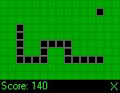



## Snake Using BitBlt \- Just Like The One On Mobile Phones\!\!\!

### Description

This is (yet another) snake game made in VB, but its the best one I've ever seen (but I guess I would say that!)... It looks just like the game you get on mobile phones, and it uses windows BitBlt so its fast.

If you like it please do vote for it. thanks :)
 
### More Info
 

             |
---                |---
**Submitted On**   |2000-08-30 23:49:46
**By**             |[Mercior](https://github.com/Planet-Source-Code/PSCIndex/blob/master/ByAuthor/mercior.md)
**Level**          |Advanced
**User Rating**    |4.2 (38 globes from 9 users)
**Compatibility**  |VB 6\.0
**Category**       |[Games](https://github.com/Planet-Source-Code/PSCIndex/blob/master/ByCategory/games__1-38.md)
**World**          |[Visual Basic](https://github.com/Planet-Source-Code/PSCIndex/blob/master/ByWorld/visual-basic.md)
**Archive File**   |[CODE\_UPLOAD1056610102000\.zip](https://github.com/Planet-Source-Code/mercior-snake-using-bitblt-just-like-the-one-on-mobile-phones__1-11985/archive/master.zip)

